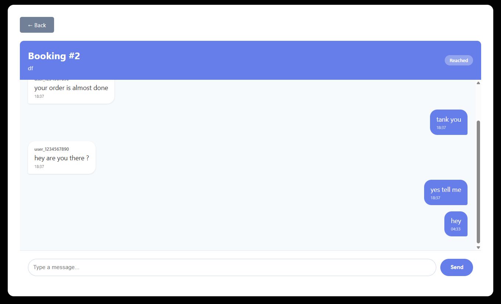

# Food Delivery Web Application

Django-based food delivery platform with real-time chat, role-based authentication, and booking management.

The project is deployed on Render (free tier).  
**Live URL:** [https://foodiehub-udwc.onrender.com](https://foodiehub-udwc.onrender.com)

*Note: This app is deployed on Render Free. Free services spin down after 15 minutes of inactivity, so the first request may take a few seconds to load while the server wakes up.*

## Screenshots

<details>
<summary>📸 View All Screenshots</summary>

### Customer Interface


### Delivery Partner Interface


### Real-Time Features


### Admin Panel


</details>

## Features

- **Customer Self-Registration**: Mobile number + OTP (static: 1234) authentication
- **Admin-Created Delivery Partners**: Admin manages delivery partner accounts
- **Real-Time WebSocket Chat**: Instant messaging between customers and assigned delivery partners
- **Booking Management System**: Create, assign, track, and update delivery bookings
- **Role-Based Access Control**: Separate interfaces for Customers, Delivery Partners, and Admin

## System Architecture

### WebSocket Connection Flow
```
Browser ←→ Daphne (ASGI) ←→ Django Channels Consumer
                                    ↓
                              Channel Layer (In-Memory)
                                    ↓
                                Database
```

## Tech Stack

- **Backend**: Django 4.x
- **Real-time Communication**: Django Channels
- **ASGI Server**: Daphne
- **Frontend**: jQuery + HTML/CSS
- **Database**: SQLite (default) / PostgreSQL (production)
- **Authentication**: Mobile OTP (static: 1234)

## Installation

### Prerequisites
```bash
Python 3.8+
pip
virtualenv (recommended)
```

### Setup Instructions

1. **Clone the repository**
```bash
git clone <repository-url>
cd food-delivery-app
```

2. **Create virtual environment**
```bash
python -m venv venv
source venv/bin/activate  # On Windows: venv\Scripts\activate
```

3. **Install dependencies**
```bash
pip install -r requirements.txt
```

4. **Run migrations**
```bash
python manage.py makemigrations
python manage.py migrate
```

5. **Create superuser (Admin)**
```bash
python manage.py createsuperuser
```

6. **Run the development server**
```bash
python manage.py runserver
```

Access the application at `http://localhost:8000`

## User Roles & Credentials

### Test Accounts

#### Customer
- **Mobile**: 9999999999
- **OTP**: 1234
- **Capabilities**: Create bookings, view bookings, cancel bookings, chat with assigned delivery partner

#### Delivery Partner
- **Mobile**: 9000000000 or 9567077637
- **Password**: (Set by admin)
- **Capabilities**: View assigned bookings, update delivery status, chat with customer

#### Admin
- **Username**: 1111111111
- **Password**: (Created during setup)
- **Capabilities**: View all bookings, assign delivery partners

## Key Functionalities

### Customer Features
- Self-registration with mobile number
- OTP authentication (static: 1234)
- Create new bookings
- View booking history
- Cancel pending bookings
- Real-time chat with assigned delivery partner

### Delivery Partner Features
- View assigned bookings
- Update booking status workflow
- Real-time chat with customer
- Status progression: `Start → Reached → Collected → Delivered`

### Admin Features
- View all bookings
- Assign bookings to delivery partners
- Manage delivery partner accounts

## Testing Real-Time Chat

### Steps to Test WebSocket Chat:

1. **Open 2 browser tabs/windows**
   - Tab 1: Customer login
   - Tab 2: Delivery Partner login

2. **Tab 1 - Customer (9999999999)**
   - Find assigned booking
   - Click "💬 Chat" button
   - Type: "Hi, where are you?"
   - Click "Send"

3. **Tab 2 - Delivery Partner (9000000000)**
   - Find same booking
   - Click "💬 Chat" button
   - **Result**: Customer's message appears instantly

4. **Delivery Partner responds**
   - Type: "I'm 5 minutes away"
   - Click "Send"

5. **Customer Tab**
   - **Result**: Delivery partner's response appears instantly

 **Real-time chat working as required!**

## Testing Status Workflow

### Delivery Status Progression:
```
Pending → Started → Reached → Collected → Delivered
```

**Test Steps:**
1. Click "Start Delivery" → Status: `Started`
2. Refresh page
3. Click "Reached Restaurant" → Status: `Reached`
4. Refresh page
5. Click "Collected Order" → Status: `Collected`
6. Refresh page
7. Click "Mark as Delivered" → Status: `Delivered`

**Result**: Status updates through complete workflow

## Project Structure
```
food-delivery-app/
├── bookings/              # Booking management app
├── chat/                  # WebSocket chat consumers
├── users/                 # User authentication & roles
├── templates/             # HTML templates
├── static/                # CSS, JS, images
├── manage.py
├── requirements.txt
└── README.md
```

## Configuration

### Django Channels Setup
```python
# settings.py
INSTALLED_APPS = [
    'daphne',
    'channels',
    # ... other apps
]

ASGI_APPLICATION = 'project.asgi.application'

CHANNEL_LAYERS = {
    'default': {
        'BACKEND': 'channels.layers.InMemoryChannelLayer'
    }
}
```

## Requirements
```txt
Django>=4.2
channels>=4.0
daphne>=4.0
```

## Deployment Notes

### Production Considerations:
- Replace In-Memory Channel Layer with Redis
- Use PostgreSQL instead of SQLite
- Implement real OTP service (Twilio, AWS SNS)
- Add HTTPS for WebSocket security (wss://)
- Configure proper CORS settings
- Set DEBUG=False

## Support & Documentation

- Django Documentation: https://docs.djangoproject.com/
- Django Channels: https://channels.readthedocs.io/

